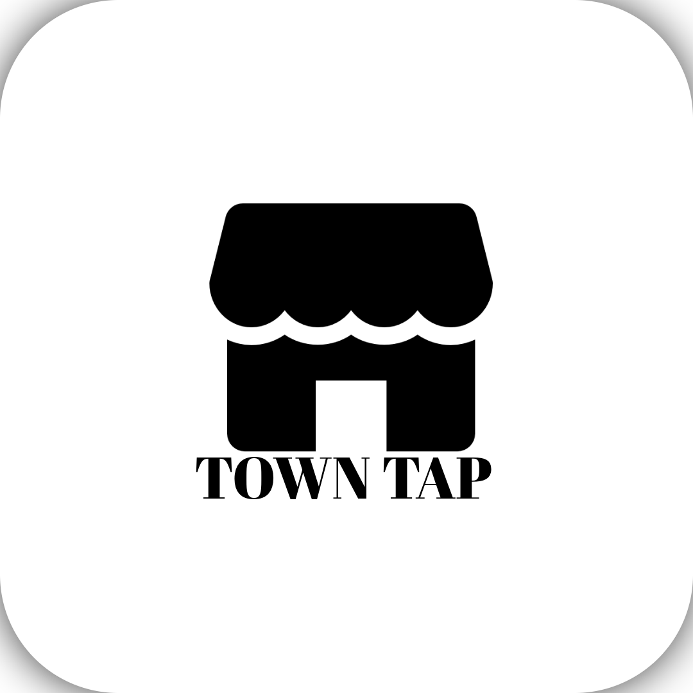

  
  
  # TownTap
  
  **Your Local Business Marketplace**
  
  *Connecting communities with local businesses through seamless mobile experiences*
  
  
  
  
  

---

## 🌟 About

TownTap is a modern, production-ready mobile application that bridges the gap between local businesses and their communities. Built with React Native and Expo, it provides a seamless platform for discovering, booking, and engaging with local services.

## ✨ Key Features

### For Customers
- **🔍 Smart Discovery** - Find local businesses by category, location, and ratings
- **📅 Easy Booking** - Schedule appointments with real-time availability
- **⭐ Reviews & Ratings** - Share experiences and read authentic reviews
- **❤️ Favorites** - Save and quickly access your preferred businesses
- **🔔 Real-time Updates** - Stay informed with instant booking notifications
- **📍 Location Services** - Discover businesses near you with GPS integration

### For Business Owners
- **📊 Business Dashboard** - Comprehensive management and analytics
- **🛍️ Service Management** - Create and manage your service catalog
- **📆 Booking Management** - Handle appointments and customer requests
- **💬 Customer Engagement** - Respond to reviews and communicate directly
- **📈 Performance Insights** - Track views, bookings, and revenue

### User Experience
- **🎨 Modern Design** - Beautiful, intuitive interface with Material Design principles
- **🌓 Dark Mode** - Full light/dark theme support with system integration
- **✨ Smooth Animations** - Fluid transitions powered by Reanimated and Moti
- **📱 Responsive** - Optimized for all device sizes and orientations
- **🔒 Secure** - End-to-end encryption with biometric authentication
- **⚡ Fast** - Optimized performance with smart caching and lazy loading
- **🌐 Offline Ready** - Queue actions when offline, sync when connected

## 🎯 Use Cases

- **Local Service Discovery**: Find plumbers, electricians, salons, restaurants, and more
- **Appointment Booking**: Schedule services with instant confirmation
- **Business Promotion**: Local businesses can showcase their services and build reputation
- **Community Building**: Connect neighborhoods with trusted local service providers
- **Review Platform**: Share and discover authentic customer experiences

## 🛠️ Technology Stack

**Frontend**
- React Native 0.81 with Expo SDK 54
- TypeScript for comprehensive type safety
- Reanimated & Moti for 60fps animations
- React Hook Form + Zod for form validation

**Backend & Services**
- Supabase (PostgreSQL, Auth, Storage, Real-time)
- Row Level Security (RLS) policies
- Real-time subscriptions for live updates
- Expo SecureStore for encrypted credential storage

**State & Performance**
- Zustand for efficient state management
- React Query for server state caching
- FlashList for optimized large lists
- Image caching and lazy loading

**Developer Experience**
- Full TypeScript coverage
- ESLint & Prettier configuration
- Jest for unit testing
- Performance monitoring

## 🚀 Built For

- **Customers** seeking trusted local services
- **Business Owners** wanting to grow their local presence
- **Communities** building stronger local economies

---

  
  **TownTap** - Empowering Local Communities
  
  Built with ❤️ using React Native & Expo
  
  © 2025 TownTap. All rights reserved.
  

 