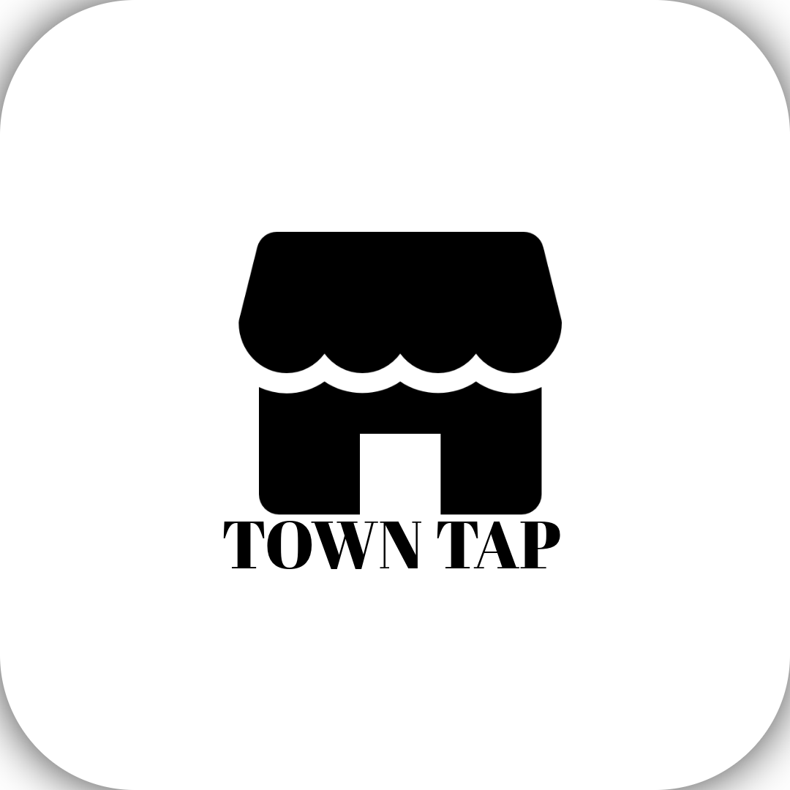

  
  
  # **TownTap - Local Business Discovery Platform**
  
  
  
  
  
  

---

**Connecting Communities with Local Businesses through Real-Time Technology**

TownTap is a comprehensive mobile application that seamlessly connects customers with local businesses and service providers across diverse categories in India. Built with React Native and powered by Supabase, it empowers small local enterprises to establish a robust online presence while offering customers unparalleled convenience for product ordering, service booking, and professional consultations within their neighborhood.

## 🌟 Vision & Mission

**Vision**: To create the most trusted and efficient platform for local commerce in India, fostering community growth and supporting small businesses.

**Mission**: Empower local businesses with digital tools while providing customers with a seamless, real-time experience for all their local needs.

## 🏗️ Architecture Overview

### Technology Stack
- **Frontend**: React Native `0.76.9` with Expo Router `4.0.0`
- **Backend**: Supabase `2.58.0` (PostgreSQL + PostGIS)
- **Authentication**: Supabase Auth with JWT
- **Real-time**: Supabase Realtime
- **Storage**: Supabase Storage
- **Serverless Logic**: Supabase Edge Functions (Deno)
- **Maps & Location**: PostGIS + Expo Location `18.0.0`
- **UI Framework**: NativeBase `3.4.28` + Custom Theme System
- **State Management**: Zustand `5.0.8`
- **Animations**: React Native Reanimated `3.16.1`

### Core Principles
- **Supabase-First**: All backend services exclusively use Supabase
- **Real-time Everything**: Live updates for all user interactions
- **Scalable Architecture**: Designed for high-volume usage
- **India-Centric**: Payment gateways and business types specific to India
- **Clean Code**: Modular, reusable, and maintainable codebase

## 🎯 Business Model: Four Interaction Types

TownTap categorizes all businesses into four distinct interaction types, each with specialized workflows:

### Type A: Order & Buy Now 🛒
**Fixed-price products, cart-based shopping, delivery/pickup**
- **Examples**: Grocery stores, pharmacies, bakeries, medical shops, bookstores
- **Features**: 
  - Real-time inventory management
  - Cart functionality with multiple payment options
  - Order tracking with live delivery updates
  - Scheduled delivery options

### Type B: Book & Track Service 📅
**Appointment-based services, live tracking, on-site service**
- **Examples**: Plumbers, electricians, barbers, cleaners, tutors, mechanics
- **Features**: 
  - Calendar-based booking system
  - Real-time service provider location tracking
  - Live status updates throughout service
  - Quote requests and negotiations

### Type C: Inquire & Consult 💬
**Lead generation, complex projects, custom consultations**
- **Examples**: Travel agencies, real estate, catering, interior design, legal services
- **Features**: 
  - Detailed inquiry forms with attachments
  - Direct communication channels
  - Proposal and quote management
  - Project milestone tracking

### Type D: Rental Services 🔄
**Time-based rentals, deposit management, condition tracking**
- **Examples**: Costume rentals, equipment rentals, vehicle rentals, event decoration
- **Features**: 
  - Availability calendar system
  - Deposit and security handling
  - Condition documentation with photos
  - Pickup/delivery coordination

## 🚀 Key Features

### For Customers
- **Universal Search**: AI-powered search across all business types
- **Location-Aware Discovery**: PostGIS-powered nearby business detection
- **Real-Time Tracking**: Live order/service status and location tracking
- **Multi-Payment Support**: UPI, Cards, Net Banking, Cash on Delivery
- **In-App Chat**: Direct communication with businesses
- **Review System**: Photo/video reviews with business responses
- **Favorites & History**: Quick access to preferred businesses
- **Multi-Language Support**: Hindi, Marathi, Tamil, Telugu, and more

### For Businesses
- **Comprehensive Dashboard**: Real-time analytics and order management
- **Inventory Management**: Live stock updates with automatic notifications
- **Service Scheduling**: Calendar-based appointment system
- **Live Location Sharing**: Real-time tracking for service providers
- **Payment Integration**: Secure payment processing with instant payouts
- **Customer Communication**: Built-in chat with payment request features
- **Marketing Tools**: Promotional campaigns and loyalty programs
- **Staff Management**: Multi-user access with role-based permissions

### For Administrators
- **Business Verification**: Document review and approval workflow
- **Transaction Monitoring**: Complete oversight of all platform activities
- **Dispute Resolution**: Integrated conflict resolution system
- **Financial Management**: Commission tracking and payout automation
- **Content Moderation**: Review and content management tools
- **Analytics Dashboard**: Platform-wide performance metrics

---

**TownTap** - *Empowering Local Communities Through Technology* 🚀

Built with ❤️ for local businesses across India